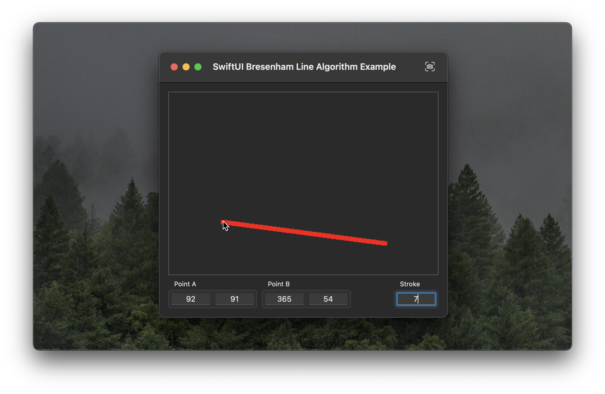

# SwiftUI Bresenham Line Algorithm Example

This repository demonstrates an implementation of the Bresenham line algorithm in a SwiftUI-lifecycle application for macOS.

The example application makes use of low-level CoreGraphics APIs instead of SwiftUI abstractions like `Canvas` or `Path` and computes individual pixels of the lines being drawn using Bresenham's line algorithm.

## Say Hi

[Follow Stephan on Twitter](https://twitter.com/stephancasas)

## License

MIT
